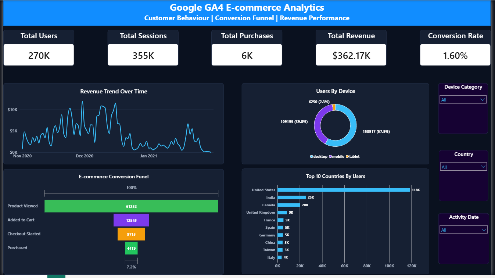
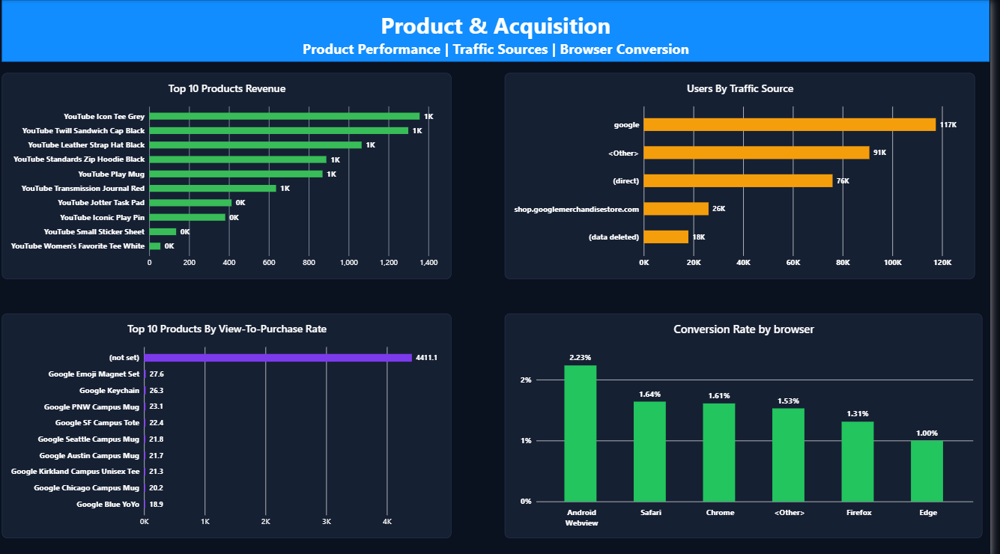

# Google GA4 E-commerce Analytics

An end-to-end analytics project built using **Google BigQuery, SQL, and Power BI** to analyze customer behaviour, website engagement, product performance, revenue trends, acquisition channels, and the e-commerce conversion funnel.

## Project Overview

This project analyzes an obfuscated Google Analytics 4 e-commerce dataset from the Google Merchandise Store. The workflow covers data exploration in BigQuery, transformation of nested GA4 event data, creation of dashboard-ready summary tables, and development of a two-page interactive Power BI dashboard.

### Key Dataset Statistics

| Metric                  |                    Value |
| ----------------------- | -----------------------: |
| Total Events            |                4,295,584 |
| Unique Users            |                  270,154 |
| Total Sessions          |                     355K |
| Purchases               |                       6K |
| Revenue                 |                 $362.17K |
| Session Conversion Rate |                    1.60% |
| Analysis Period         | 1 Nov 2020 – 31 Jan 2021 |

## Dashboard Preview

### Executive Overview



The executive page presents the main KPIs, daily revenue trend, e-commerce conversion funnel, device distribution, leading countries, and interactive date, device, and country filters.

### Product & Acquisition Analysis



The second page focuses on product revenue, product-level conversion, acquisition sources, and browser conversion performance.

## Business Questions

* How many users, sessions, events, purchases, and sales were generated?
* How did traffic and revenue change during the analysis period?
* Which countries, devices, browsers, and acquisition sources performed best?
* Where did users drop out of the product-to-purchase funnel?
* Which products generated the most revenue?
* Which products achieved the strongest view-to-purchase conversion?
* What proportion of purchasers were one-time versus repeat customers?
* What was the cart-abandonment rate?
* How did monthly revenue and customer retention change over time?

## Key Insights

* The dataset contains **4.29 million events generated by 270K users** over 92 days.
* Desktop accounted for approximately **57.9% of users**, followed by mobile at **39.8%** and tablet at **2.3%**.
* The United States was the largest market with approximately **118K users**, followed by India and Canada.
* Google was the leading acquisition source with approximately **117K users**; direct traffic also made a substantial contribution.
* The funnel contained **61,252 product viewers**, **12,545 cart users**, **9,715 checkout users**, and **4,419 purchasing users**.
* The largest funnel drop occurred between product view and add-to-cart, with a view-to-cart rate of **20.48%**.
* The cart-to-checkout rate was **77.44%**, while the checkout-to-purchase rate was **45.49%**.
* Revenue was strongest around the November–December holiday period and weakened during January.
* Browser conversion varied materially, with Android WebView leading the displayed browsers at approximately **2.23%**.
* Product conversion analysis used a minimum-view threshold to prevent low-volume products from appearing as reliable high performers.

## Tools and Technologies

* **Google BigQuery** – Querying the public GA4 dataset and creating dashboard-ready tables
* **SQL** – Data exploration, transformation, funnel analysis, segmentation, and retention analysis
* **Power BI** – Data modelling, DAX measures, interactive visualization, and dashboard design
* **GitHub** – Project documentation and portfolio presentation

## SQL Techniques Demonstrated

* Common Table Expressions (CTEs)
* Conditional aggregation using `CASE WHEN`, `IF`, and `COUNTIF`
* Window functions including `LAG()` and `SUM() OVER()`
* Nested and repeated-field processing using `UNNEST`
* Date parsing, formatting, truncation, and date-difference calculations
* `SAFE_DIVIDE` for reliable ratio calculations
* Distinct user, order, and transaction analysis
* Funnel and cart-abandonment analysis
* One-time versus repeat purchaser segmentation
* Month-over-month revenue growth
* Monthly cohort-retention analysis

The complete SQL analysis is available in [`GA4_Ecommerce_17_Queries.sql`](GA4_Ecommerce_17_Queries.sql).

## Power BI Measures

```DAX
Total Users =
DISTINCTCOUNT(user_daily_summary[user_pseudo_id])
```

```DAX
Total Sessions =
SUM(user_daily_summary[total_sessions])
```

```DAX
Total Purchases =
SUM(user_daily_summary[purchases])
```

```DAX
Total Revenue =
SUM(user_daily_summary[revenue])
```

```DAX
Conversion Rate =
DIVIDE([Total Purchases], [Total Sessions], 0)
```

## Repository Structure

```text
Google-GA4-Ecommerce-Analytics/
├── GA4_Ecommerce_17_Queries.sql
├── Google_GA4_Ecommerce_Dashboard.pbix
├── Executive_Overview.png
├── Product_Acquisition.png
└── README.md
```

## Data Source

Google Analytics 4 public sample e-commerce dataset:

```text
bigquery-public-data.ga4_obfuscated_sample_ecommerce.events_*
```

The dataset contains obfuscated event-level data that emulates a real Google Analytics e-commerce implementation.

## How to Use This Project

1. Open the SQL file in Google BigQuery and run individual analysis queries.
2. Open the `.pbix` file in Power BI Desktop.
3. Authenticate with Google BigQuery and refresh the model if necessary.
4. Use the date, device, and country slicers to explore performance.

## Project Outcome

This project demonstrates the ability to work with complex GA4 event data, translate business questions into SQL, prepare analytical tables in a cloud warehouse, and communicate findings through an interactive Power BI dashboard.

## Author

**Rohan Jha**
Aspiring Data Analyst | SQL | Power BI | Python | Excel

